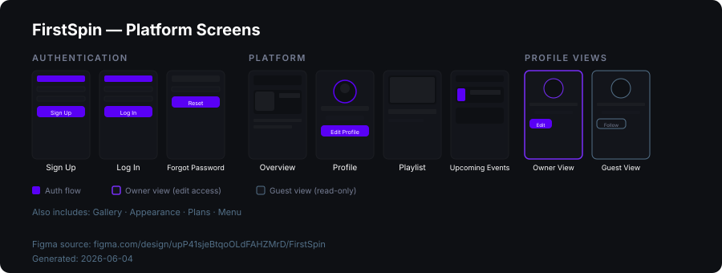
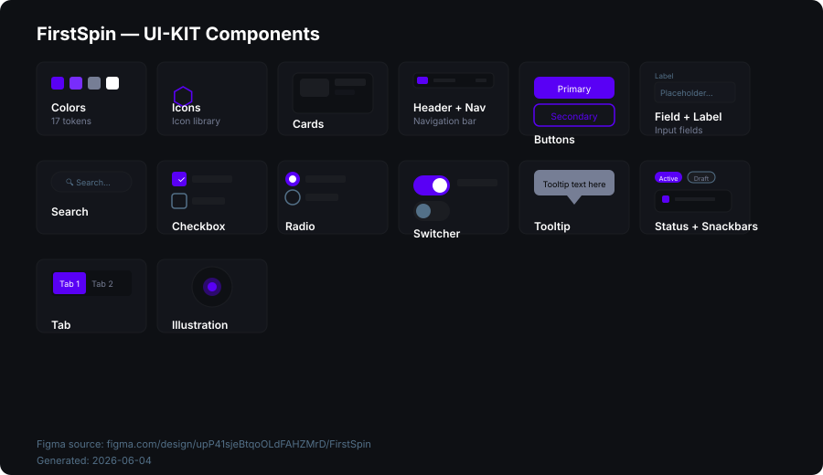
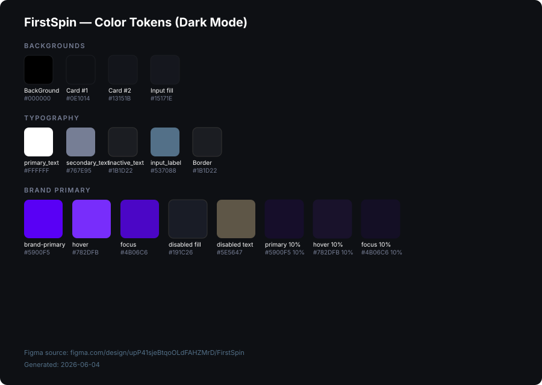

# FirstSpin — Design System Documentation

> Platform for musicians and bands. Dark-themed UI with a purple brand accent.
>
> 🔗 [Open in Figma](https://www.figma.com/design/upP41sjeBtqoOLdFAHZMrD/FirstSpin)

---

## File Structure

| Page | Description |
|------|-------------|
| **Presentation** | Project overview and pitch deck |
| **Platform** | All app screens + UI-KIT |
| **Cover** | File cover / thumbnail |

The **Platform** page contains two top-level frames:

- `Platform Desktop & Mobile` — all product screens
- `UI-KIT` — design system components

---

## Platform Screens

### Authentication

| Screen | Description |
|--------|-------------|
| Sign Up | New user registration form |
| Log In | Email + password login |
| Forgot Password | Password reset flow (multi-step) |

### Core Platform

| Screen | Description |
|--------|-------------|
| Overview | Main dashboard with charts and activity feed |
| Profile | User / band profile page |
| Menu | Navigation side-panel |
| Playlist | Music playlist management |
| Upcoming Events | Event listing and calendar |
| Gallery | Photo / media gallery |
| Appearance | Profile customization & theming |
| Plans | Subscription tier selection |

### Profile Views

| Screen | Description |
|--------|-------------|
| Owner View | Profile as seen by the owner — includes edit controls |
| Guest View | Profile as seen by a visitor — read-only with Follow CTA |

---

## UI-KIT Components

| Component | Description |
|-----------|-------------|
| **Colors** | Semantic color tokens (17 tokens, dark mode) |
| **Icons** | Icon library |
| **Cards** | Content card variants |
| **Header + Navigation Bar** | Top nav bar and sidebar navigation |
| **Buttons** | Primary, Secondary, Ghost, Disabled states |
| **Field + Label** | Input fields with label and error states |
| **Search** | Search bar component |
| **Checkbox** | Checked, unchecked, indeterminate states |
| **Radio** | Radio button group |
| **Switcher** | Toggle switch (on/off) |
| **Tooltip** | Contextual tooltip overlay |
| **Status + Snackbars** | Status badges and notification toasts |
| **Tab** | Horizontal tab navigation |
| **Illustration** | Decorative illustration set |

---

## Color Tokens

### Backgrounds

| Token | Dark Mode | Usage |
|-------|-----------|-------|
| `BackGround` | `#000000` | Page background |
| `Card_#1 layer` | `#0E1014` | First card layer — primary content areas |
| `Card_#2 layer` | `#13151B` | Second card layer — nested content |
| `Input_fill` | `#15171E` | Input background (3rd level contrast) |

### Typography

| Token | Dark Mode | Usage |
|-------|-----------|-------|
| `primary_text` | `#FFFFFF` | Main content text |
| `secondary_text` | `#767E95` | Supplementary / explanation text |
| `Inactive_text` | `#1B1D22` | Muted / disabled text |
| `Input_label` | `#537088` | Input field label |

### Borders & Dividers

| Token | Dark Mode | Usage |
|-------|-----------|-------|
| `Border` | `#1B1D22` | Separates content blocks |

### Brand — Primary

| Token | Value | Usage |
|-------|-------|-------|
| `brand-primary` | `#5900F5` | Main CTA buttons |
| `brand-primary_light` | `#5900F5` 10% | Transparent tint on primary |
| `brand-primary_hover` | `#782DFB` | Hover state |
| `brand-primary_hover_light` | `#782DFB` 10% | Hover tint |
| `brand-primary_focus` | `#4B06C6` | Focus / active state |
| `brand-primary_focus_light` | `#4B06C6` 10% | Focus tint |
| `brand-primary_disable fill` | `#191C26` | Disabled button fill |
| `brand-primary_disable_text` | `#5E5647` | Disabled button label |

---

## Design Tokens — Variable Modes

The UI-KIT uses Figma variable collections for theming:

| Collection | Active Mode |
|------------|-------------|
| `Collection 1` | Dark Theme |
| `001. primitives` | Mode 1 |
| `002. semantic` | Mode 1 |
| `Color Mode Car...` | Light Mode |
| `Colors` | Auto (Light) |
| `MeshKloud` | Light Version |

---

## Responsive Coverage

Screens are designed for both **Desktop** and **Mobile** breakpoints within the same `Platform Desktop & Mobile` frame group.

---

*Last updated: 2026-06-04 · Source: [Figma / FirstSpin](https://www.figma.com/design/upP41sjeBtqoOLdFAHZMrD/FirstSpin)*
